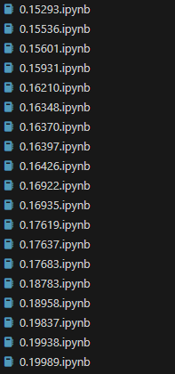

# 스트레스 지수 예측 프로젝트

### 1. 대회 개요
* **대회명**: 데이콘 Basic 스트레스 지수 예측
* **목표**: 건강 데이터를 활용하여 개인의 스트레스 지수를 예측하는 모델 개발
* **평가 지표**: MAE (Mean Absolute Error)
* **참가 규칙**: 외부 데이터 사용 불가, AutoML 패키지 사용 불가, 개인 참여.
* **최고 성과**: Public Leaderboard 점수 0.15293

---

### 2. 데이터 분석 및 전처리

#### 2.1 데이터 개요 및 결측치 현황
* **데이터셋 크기**: `train`과 `test` 데이터 모두 3,000개의 샘플로 구성.
* **결측치**: `medical_history`(43%), `family_medical_history`(50%), `edu_level`(20%), `mean_working`(35%) 컬럼에서 높은 비율의 결측치를 확인.
* **이상치**: bone_density 컬럼에서 음수 값이 발견되어 이상치로 판단.
* **결측치 패턴**: `medical_history`와 `family_medical_history` 결측치가 높은 상관관계를 보였으며, 이는 결측치 자체가 의미있는 정보가 될 수 있음을 시사.

#### 2.2 결측치 분석 후 인사이트
결측치가 무작위로 발생하는 것이 아닐 수 있다는 가설을 세우고, 박스플롯 분석을 통해 결측치가 있는 그룹과 없는 그룹 간의 변수 분포 차이를 분석했습니다.

family_medical_history 결측 그룹은 weight, systolic_blood_pressure의 분포가 다른 그룹과 상이했음.

mean_working 결측 그룹은 cholesterol 수치가 더 낮은 경향을 보였음.
이러한 분석을 통해 결측치 자체에 정보가 담겨 있을 수 있다는 인사이트를 얻었고, 이를 바탕으로 'unknown' 카테고리를 활용하는 전처리 전략을 수립했습니다.

#### 2.2 전처리 및 이상치 처리 전략
* **이상치 처리**: `bone_density`의 음수 값은 0으로 대체.
* **결측치 처리**:
    * `medical_history`, `family_medical_history`, `edu_level`: 'unknown' 카테고리로 채움.
    * `mean_working`: `smoke_status`와 `edu_level`을 기준으로 그룹별 중앙값으로 채움.
* **인코딩**: 모든 범주형 변수에 대해 원-핫 인코딩을 적용.
* **스케일링**: 수치형 변수들의 스케일을 맞추기 위해 `StandardScaler`를 사용.

---

### 3. 특징 공학 및 모델링

#### 3.1 효과적인 파생 변수
여러 실험을 통해 모델 성능을 향상시킨 핵심 파생 변수는 다음과 같습니다.
* **체질량지수(BMI)**: `weight / (height / 100) ** 2`
* **맥압(Pulse Pressure)**: `systolic_blood_pressure - diastolic_blood_pressure`
* **콜레스테롤-혈당 비율**: `cholesterol / (glucose + 1)`
* **혈압 교호 작용**: `systolic_blood_pressure * diastolic_blood_pressure`
* **혈압 합산**: `systolic_blood_pressure + diastolic_blood_pressure`

Permutation Importance 분석을 통해 변수 중요도를 측정. 이를 기준으로 파생 변수들을 하나씩 추가하거나 제거하면서 점수를 확인하는 정밀한 실험을 진행

* **긍정적 효과를 보인 파생 변수**

| 파생 변수 명 | RMSE 변화 (로컬) | 효과 |
| :--- | :---: | :---: |
| 체질량지수 (BMI) | -0.00140 | 매우 좋음 |
| 맥압 (Pulse Pressure) | -0.00099 | 좋음 |
| 혈압 교호 작용 | -0.00072 | 좋음 |
| 혈압 카테고리 | -0.00036 | 조금 있음 |
| 근무 시간 그룹 | -0.00030 | 조금 있음 |
| 콜레스테롤-혈당 비율 | -0.00010 | 미미함 |
| 콜레스테롤-골밀도 비율 | -0.00010 | 미미함 |

* **효과가 없거나 부정적이었던 파생 변수**

| 파생 변수 명 | RMSE 변화 (로컬) | 효과 |
| :--- | :---: | :---: |
| 나이-콜레스테롤 교호 작용 | +0.00290 | 매우 나쁨 |
| 나이-근무시간 비율 | +0.00260 | 매우 나쁨 |
| 근무시간-수축기 혈압 교호 작용 | +0.00231 | 매우 나쁨 |
| 혈당-근무시간 교호 작용 | +0.00194 | 나쁨 |
| 나이대 그룹 | +0.00092 | 나쁨 |
| 건강 지표 종합 점수 | +0.00057 | 나쁨 |

#### 3.2 모델 튜닝 및 최적화
* **모델**: LightGBM과 XGBoost 모델을 사용.
* **하이퍼파라미터 튜닝**: `RandomizedSearchCV`와 교차 검증을 통해 최적의 파라미터를 탐색.
* **변수 선택**: 변수 중요도 분석을 통해 `sleep_pattern_sleep difficulty`와 같이 중요도가 낮은 변수들을 제거.

최적의 모델을 찾기 위해 다양한 시도를 했습니다.

모델: LightGBM, XGBoost 등 Gradient Boosting 모델을 단독으로 학습했습니다.

* **하이퍼파라미터 튜닝**: 최적의 파라미터를 찾기 위해 교차 검증(KFold)과 RandomizedSearchCV, Optuna 등을 활용하여 튜닝을 진행했습니다.

* **앙상블/스태킹**: 여러 모델의 예측 결과를 결합하는 앙상블(VotingRegressor)과 스태킹(StackingRegressor) 기법을 시도했으나, 단독 XGBoost 모델의 성능을 뛰어넘지 못했습니다.

* **변수 제거**: Permutation Importance 분석을 통해 medical_history_heart disease, activity_moderate 등 중요도가 낮은 변수를 제거하는 실험을 진행했습니다. 하지만 이 변수들을 제거할수록 오히려 점수가 0.162대로 악화되었습니다. 이는 모든 변수가 예측에 미미하게나마 기여하고 있다는 것을 의미하는 중요한 결과였습니다.

---

### 4. 최종 모델 및 결과
모든 시도 끝에, 최적의 파생 변수를 모두 포함하고 하이퍼파라미터 튜닝을 마친 **XGBoost 단일 모델이 가장 안정적이고 높은 성능**을 보였습니다.

* **최종 모델**: 하이퍼파라미터 튜닝을 마친 **XGBoost 단일 모델**을 최종 모델로 선정.
* **최고 점수**: 대시보드 RMSE 점수 **0.15293** 달성.
* **노트북 관리**: 점수 개선이 있을 때마다 새로운 노트북 파일(예: `notebooks/submission_01.ipynb`, `notebooks/submission_02.ipynb`)을 만들어 기록하는 방식으로 진행.

---

### 5. 기술 스택
* **언어**: Python(3.13.5)
* **주요 라이브러리**: 
pandas==2.2.3
numpy==2.1.3
scikit-learn==1.6.1
xgboost==3.0.3
lightgbm==4.6.0
* **환경**: Jupyter Notebook, Visual Studio Code

---

### 6. 결론
본 프로젝트는 데이터 탐색, 특징 공학, 모델 최적화 과정을 체계적으로 반복하며 예측 성능을 점진적으로 향상시켰습니다. 특히 단순한 전처리와 직관적인 파생 변수가 복잡한 앙상블이나 변수 제거보다 더 좋은 결과를 낼 수 있다는 중요한 인사이트를 얻었습니다. 이는 데이터의 기본적인 특성을 최대한 보존하고, 모델이 스스로 패턴을 학습하도록 하는 것이 중요하다는 것을 보여줍니다.

### 실패했지만 가치 있었던 시도들:

* **중요도 낮은 변수 제거**: Permutation Importance 분석을 통해 medical_history_heart disease, activity_moderate 등 중요도가 낮은 변수를 제거하는 실험을 진행했습니다. 하지만 이 변수들을 제거할 때마다 로컬 검증 점수(RMSE)와 대시보드 점수 모두 0.161~0.162대로 악화되었습니다. 이는 모든 변수가 예측에 미미하게나마 긍정적으로 기여하고 있다는 것을 깨닫게 해준 중요한 경험이었습니다.

* **파생 변수 확장**: 기존에 만든 파생 변수 외에 중요도가 높았던 변수들(height, cholesterol, bp_interaction 등)을 조합하여 새로운 파생 변수를 추가했습니다. 예를 들어, height / cholesterol 비율, height * bp_interaction 교호 작용 등 다양한 시도를 했지만, 이들 변수는 기존 모델의 성능을 넘어서지 못했습니다. 이 경험은 무작정 많은 파생 변수를 만드는 것보다, 데이터의 본질적인 특성을 반영하는 직관적인 변수가 더 효과적일 수 있다는 교훈을 주었습니다.

* **앙상블/스태킹**: (VotingRegressor)과 스태킹(StackingRegressor) 기법을 시도했습니다. 하지만 단일 XGBoost 모델이 이미 높은 성능을 내고 있었고, 앙상블/스태킹 모델은 점수 개선에 실패하거나 오히려 과적합 문제를 일으키는 경향을 보였습니다. 이를 통해 데이터의 복잡도가 특정 수준 이상이 아닐 때는 단일 모델이 더 효율적이고 안정적인 성능을 보일 수 있다는 인사이트를 얻었습니다.